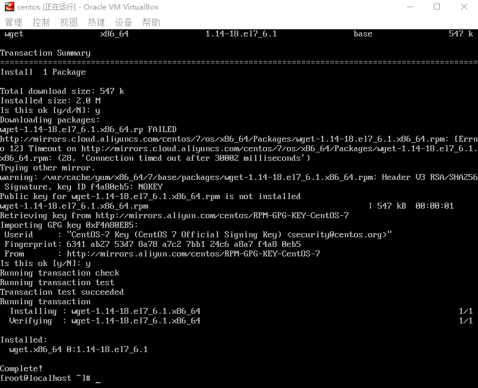
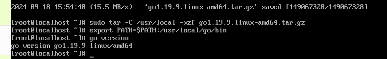
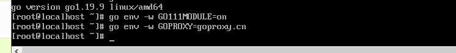

#  VirtualBox安装Linux

##  设置个人信息

用户名：user

密码：1-8

## centos版本

`CentOS-7-x86_64-Minimal-2009.iso`

## 安装步骤

### 新建虚拟电脑


- 之后设置各种信息即可，新建完成后，进行下面操作


- 顺序改成 光驱第一 硬盘第二


- 然后启动即可


### 安装 CentOS 7

- 进入安装向导后设置语言：中文，时间：上海
- 分区可以直接自动分区，也可以手动设置（自定义）
- 网络可以先不管
- 等待时候可以设置一下密码，用户可以不设置


- 下面登录的时候，localhost login:  root    password：上面设置的那个


- 进行网络配置
  - 使用ip addr 看一下网卡名称——我反正没看懂
  - 输入以下命令来编辑网络配置文件：`sudo vi /etc/sysconfig/network-scripts/ifcfg-enp0s3`
  - 下面两个部分得改一下，如果如果您的网络接口名称不是enp0s3，请相应地替换它。

```
BOOTPROTO=dhcp
ONBOOT=yes
```


- 重启网络服务 ：`sudo systemctl restart network`
- ping一下宿主机及公网

```
ping 192.168.0.1
ping www.baidu.com
```


# 基础Linux命令

## vim命令

> i  --- insert
>
> 在 Vim 中，按下 `Esc` 键可以 switching to normal mode (退出输入模式)。
>
> 在 normal mode 中，可以使用以下命令退出 Vim：
>
> 1. 输入 `:q` 并按下 `Enter` 键可以保存修改并退出。
> 2. 输入 `:q!` 并按下 `Enter` 键可以不保存修改并强制退出。
> 3. 输入 `:wq` 并按下 `Enter` 键可以保存修改并退出。
> 4. 输入 `:wq!` 并按下 `Enter` 键可以保存修改并强制退出。
> 5. 输入 `:x` 并按下 `Enter` 键可以保存修改并退出。
> 6. 输入 `:exit` 或 `:exi` 并按下 `Enter` 键可以保存修改并退出。
> 7. 输入 `:exit!` 或 `:exi!` 并按下 `Enter` 键可以不保存修改并强制退出。
>
> 如果你忘记在什么模式下，可以尝试按下 `Esc` 键直到你回到 normal mode，然后再按下上述退出命令。

##  日常命令

- 查找某个文件夹的位置
  - `find 起始目录 -type d -name "文件夹名"`
  - 当前目录 `.` 或根目录 `/`。

- 快速清理文件内容：
  - `%d 回车`
- 删除一行
  - `ctrl+e` 光标移到最后
  - `ctrl+u` 删除光标前面的
  - 上面是个组合-----
  - `ctrl+a `把光标移动到最前
  - `ctrl+k`  光标处往后删除
  
- 查看版本号
  - `**cat /etc/redhat-release**`

- yum
  - 检查是否安装了软件包
    - `yum list installed | grep <软件包名称>`
    - eg: `yum list installed | grep gcc`
  - 检查yum是否可用  `yum list`
  - yum源配置（阿里云）
    - 安装`wget`: `yum install -y wget`
    - 备份/etc/yum.repos.d/CentOS-Base.repo文件: `cd /etc/yum.repos.d/`; `mv CentOS-Base.repo CentOS-Base.repo.back`
    - 下载阿里云的Centos-6.repo文件: `wget -O CentOS-Base.repo http://mirrors.aliyun.com/repo/Centos-7.repo`

- 设置网络代理服务器
  - `export http_proxy=http://代理服务器IP:端口号`
  - `export https_proxy=http://代理服务器IP:端口号`
- 取消代理
  - `unset http_proxy`
  - `unset https_proxy`

- 关机命令
  - `sudo shutdown -h now`：该命令会立即关闭系统，并且会发送一个终端警告信息给已登录的用户，即将关闭系统。
- 重启命令
  - `sudo shutdown -r now`

- 终端上下滑动
  - `shift + pageUp / pageDown`

- ping:

  - ping -c 次数 ip  ping多少次 免的手动停止 `ctrl + z`

  - `ping -c 5 127.0.0.1` 本地ping 5次
- ping停止方法
  - 用` ctrl+c`终止ping
- 查看ip地址
  - `ip addr show`
  
  - ip addr  一样   `ip a`
  
  - hostname -i  查看当前机器的ip地址
  
- 查看文件内容
  - cat filename
- 查看文件目录有多少内容
  - ls
- wget命令
  - 通过 `wget` 工具从指定的网址下载文件
    - `wget https://golang.google.cn/dl/go1.19.9.linux-amd64.tar.gz`：执行此命令后，系统会下载一个名为 	`go1.19.9.linux-amd64.tar.gz` 的压缩文件，其中包含 Go 编程语言的二进制文件，可以用于在 Linux 64 位系统上	安装和运行 Go 语言。
- 创建文件夹
  - `mkdir my_folder`：创建一个  my_folder 文件夹
  - `mkdir -p parent_folder/child_folder`：创建一个名为 `parent_folder` 的父文件夹以及其内部的 `child_folder`
  - `-p` 选项确保父目录存在，如果目录已存在，则不会报错。
- 终端显示上一屏内容
  - 执行命令的时候在后面加上`> result.txt`，这样就可把结果输出到文件，就方便查看和查找相应的内容了。所以推荐用这种方法。

- 从阿里云镜像下载 CentOS 7 的 YUM 仓库配置文件，并将其保存到本地指定目录
  - `curl -o /etc/yum.repos.d/CentOS-Base.repo http://mirrors.aliyun.com/repo/Centos-7.repo`
    - 详细解释：
      - **`curl`**: 用于从指定 URL 下载数据的命令行工具。
      - **`-o /etc/yum.repos.d/CentOS-Base.repo`**: 指定将下载的文件保存到本地的路径和文件名。
        - `-o` 选项表示将下载的文件保存为指定名称。
        - `/etc/yum.repos.d/CentOS-Base.repo` 是目标路径，表示将文件保存为 `CentOS-Base.repo`，位于 `/etc/yum.repos.d/` 目录下。这个目录通常是存储 YUM 仓库配置文件的地方。
      - **`http://mirrors.aliyun.com/repo/Centos-7.repo`**: 这是文件的下载地址。该 URL 指向阿里云提供的 CentOS 7 YUM 仓库的配置文件。

- 退出当前目录
  - `cd ..` 上级目录..（两个点）

- 删除文件
  - `rm [option] filename`
  - option
    - "rm -f" 强行删除，忽略不存在的文件，不提示确认。(f为force的意思)
    - "rm -i" 进行交互式删除，即删除时会提示确认。(i为interactive的意思)
    - "rm -r" 将参数中列出的全部目录和子目录进行递归删除。(r为recursive的意思)
    - "rm -v" 详细显示删除操作进行的步骤。(v为verbose的意思)
  - `rm -r 目录名`:递归删除目录下的所有文件
  
- 查看yum源
  - `yum repolist`


## docker常用命令

`sudo systemctl daemon-reload`

- 它的作用是在你修改或新增了 `systemd` 的服务文件（如 `.service`、`.socket` 等）后，通知 `systemd` 守护进程重新加载这些配置文件，以便它们生效。

`sudo systemctl restart docker`

- 重启docker服务

#  安装项目所需依赖

参考该链接：https://docs.chainmaker.org.cn/dev/%E5%8F%AF%E9%AA%8C%E8%AF%81%E6%95%B0%E6%8D%AE%E5%BA%93%E4%BD%BF%E7%94%A8%E6%96%87%E6%A1%A3.html

##  安装准备

###  安装wget命令行工具

- 在进行部署前，先在Linux安装对应的工具

​	`sudo yum install wget`：首先安装wget命令行工具

> 命令 `sudo yum install wget` 用于在基于 Red Hat 系列的 Linux 发行版（如 CentOS、RHEL、Fedora）上通过 `yum` 包管理器安装 `wget` 工具。以下是对该命令的详细解释：
>
> - **`sudo`**: 以超级用户（root）权限执行命令。安装软件需要管理员权限，所以使用 `sudo` 来确保具有足够的权限。
> - **`yum`**: 是 Red Hat 系列 Linux 发行版中的包管理器，用于安装、更新、删除和管理软件包。
> - **`install`**: 这是 `yum` 的一个子命令，表示要安装指定的软件包。
> - **`wget`**: 这是要安装的软件包的名称。`wget` 是一个常用的命令行工具，用于从网络下载文件。
>
> **命令 `sudo yum install wget` 的作用是通过 `yum` 包管理器安装 `wget` 工具，并且使用 `sudo` 提升权限以确保安装操作的成功。执行该命令后，系统会连接到相应的软件仓库，下载并安装 `wget` 及其依赖项。**

出现如下错误：

**解决方法**：`4.1`，然后安装成功



### 3.1.2 安装 go 1.19.9

```
wget https://golang.google.cn/dl/go1.19.9.linux-amd64.tar.gz
sudo tar -C /usr/local -xzf go1.19.9.linux-amd64.tar.gz
export PATH=$PATH:/usr/local/go/bin
go version
```




### 3.1.3 配置Go代理

```
go env -w GO111MODULE=on
go env -w GOPROXY=goproxy.cn
```

代码解释：

​	这两行代码用于配置 Go 语言的环境变量，主要与 Go 模块管理和代理设置相关。它们通过 `go env -w` 命令来写入环境变量的值，永久地改变 Go 的配置。

```
go env -w GO111MODULE=on
```

- **`go env -w`**: 这个命令用于写入（write）Go 环境变量的值。
- **`GO111MODULE=on`**: 这是设置 Go 的模块管理模式。

**解释：**

`GO111MODULE` 是 Go 的一个环境变量，用于控制 Go 模块管理的行为：

- **`on`**: 强制启用 Go 模块，无论项目是在 `$GOPATH` 目录下还是其他地方。模块是 Go 从 1.11 开始引入的包管理方式，它可以更好地管理依赖版本。

通过运行这行代码，Go 将始终使用模块（module）来管理依赖，而不再依赖传统的 `$GOPATH` 方式。

```
go env -w GOPROXY=goproxy.cn
```

- **`go env -w`**: 同样是写入环境变量。
- **`GOPROXY=goproxy.cn`**: 设置 Go 代理的地址。

**解释：**

`GOPROXY` 是 Go 的一个环境变量，用于指定 Go 模块的代理服务器。当你使用 `go get` 或其他命令安装依赖时，Go 会从这个代理服务器下载模块，而不是直接从 GitHub 或其他原始仓库下载。

- **`goproxy.cn`**: 这是中国的 Go 模块代理服务器，由七牛云维护。通过使用这个代理，开发者可以加快模块的下载速度，避免网络不稳定导致的依赖安装问题。



### 3.1.4 安装 7zip

```
sudo yum -y install epel-release
sudo yum -y install p7zip p7zip-plugins
```


### 3.1.5 安装docker

```
sudo yum -y install yum-utils
sudo yum-config-manager --add-repo https://download.docker.com/linux/centos/docker-ce.repo
sudo yum -y install docker-ce docker-ce-cli containerd.io docker-buildx-plugin docker-compose-plugin
sudo systemctl start docker
sudo docker run hello-world
```


`sudo yum-config-manager --add-repo https://download.docker.com/linux/centos/docker-ce.repo` 出现错误，看 `4.2`


`sudo docker run hello-world`运行出错，看`4.3部分`

> [!important]
>
> 找到了一个镜像网站，`https://hub.atomgit.com/`，通过这个网站，找到需要的镜像，然后点击，进入然后敲命令即可。


## 安装长安链v2.3.1

###  安装git

`sudo yum install git`

### 安装golang

不需要再安装了，因为`3.1`已经安装过了

不过刚开始检查是否安装go的时候，执行`go version`，出现 `command not found`命令

但是最后 执行了一下`export PATH=$PATH:/usr/local/go/bin`，之后再`go version` 就没问题了

`永久添加 Go 到 PATH 中`

- 修改用户的 `.bashrc` 或 `.bash_profile` 文件

1. 打开 `.bashrc` 或 `.bash_profile` 文件（根据使用的 shell 不同可能是 `.bashrc` 或 `.bash_profile`，如果是 zsh，使用 `.zshrc`）。

   ```
   vi ~/.bashrc
   ```

2. 在文件的末尾添加下面这行代码：

   ```
   export PATH=$PATH:/usr/local/go/bin
   ```

3. 保存文件并退出编辑器。

4. 运行下面的命令使修改立即生效：

   ```
   source ~/.bashrc
   ```

### 安装gcc

`sudo yum install centos-release-scl`


`sudo yum install devtoolset-7-gcc*`

显示没有软件包

`scl enable devtoolset-7 bash`

 上面第二条第三条命令无法运行，换了好几个yum源都没办法。

换了一种方法，最后实现图示结果：


> 参考网址：https://www.xiehai.zone/2023-05-24-centos-gcc-glibc-upgrade.html

#  环境搭建

## 源码下载

- 首先注册
- 然后 下载`chainmaker-go`源码到本地
  - `git clone -b v2.3.1 --depth=1 https://git.chainmaker.org.cn/chainmaker/chainmaker-go.git`


- 下载`证书生成工具`源码到本地
  - `git clone -b v2.3.0  --depth=1 https://git.chainmaker.org.cn/chainmaker/chainmaker-cryptogen.git`


## 源码编译

- 编译证书生成工具
  - `cd chainmaker-cryptogen`
  - `make`


## 配置文件生成

- 将编译好的`chainmaker-cryptogen`，软连接到`chainmaker-go/tools`目录

```
# 进入工具目录
$ cd chainmaker-go/tools

# 软连接chainmaker-cryptogen到tools目录下
$ ln -s ../../chainmaker-cryptogen/ .
```


### PermissionedWithCert

原始的身份模式，即证书模式

进入`chainmaker-go/scripts`目录，执行`prepare.sh`脚本生成单链4节点集群配置，存于路径`chainmaker-go/build`中

> `prepare.sh`脚本支持生成`solo`模式节点证书和配置，以及4/7/10/13/16节点的证书和配置


- ` cd ../scripts` # 进入脚本目录
- `./prepare.sh -h` # 查看脚本帮助
- `./prepare.sh 4 1` # 生成单链4节点集群的证书和配置
  - 一直回车即可
- `tree -L 3 ../build/` # 查看生成好的节点证书和配置
  - 要提前安装 tree: `yum -y install tree`


>- 关于自动生成的端口说明
>
>通过`prepare.sh`脚本生成的配置，默认是在单台服务器上部署，故自动生成的端口号，是从一个起始端口号开始依次递增，可以通过命令行参数修改起始端口号。
>
>主要有2个端口，`p2p`端口（用于节点互联）和`rpc`端口（用于客户端与节点通信），`p2p`起始端口为`11301`，`rpc`起始端口为`12301`。
>
>如果生成4个节点的配置，`p2p`端口分别为：`11301、11302、11303、11304`，`rpc`端口分别为：`12301、12302、12303、12304`
>
>如果是在多机部署，希望生成固定的端口号，请参考：[【多机部署】](https://docs.chainmaker.org.cn/v2.3.1/html/instructions/多机部署.html)


## 编译及安装包制作

- 生成证书（prepare.sh脚本）后执行`build_release.sh`脚本，将编译`chainmaker-go`模块，并打包生成安装，存于路径`chainmaker-go/build/release`中
- `./build_release.sh`

- `tree ../build/release/`


## 启动节点集群

- 执行`cluster_quick_start.sh`脚本，会解压各个安装包，调用`bin`目录中的`start.sh`脚本，启动`chainmaker`节点


- 启动成功后，将*.tar.gz备份，以免下次启动再次解压缩时文件被覆盖
- `mkdir -p ../build/bak`
- `mv ../build/release/*.tar.gz ../build/bak`

>若需要关闭集群，使用脚本：
>
>`./cluster_quick_stop.sh`

## 查看节点启动使用正常

- 查看进程是否存在`ps -ef|grep chainmaker | grep -v grep`


- 查看端口是否监听 `netstat -lptn | grep 1230`

  - 需要先安装`net-tools`:  `sudo yum install net-tools`

  

- 检查节点是否有`ERROR`日志

  - `cat ../build/release/*/bin/panic.log`

  - `cat ../build/release/*/log/system.log`

  - `cat ../build/release/*/log/system.log |grep "ERROR\|put block\|all necessary"`

  - ```
    若看到all necessary peers connected则表示节点已经准备就绪。
    ```


# 使用CMC命令行工具部署、调用合约

为了验证所搭建的链功能是否正常，可以通过`cmc`命令行工具来进行验证。

## 编译&配置

cmc工具的编译&运行方式如下：

​	创建工作目录 $WORKDIR 比如 ~/chainmaker——我真的是，干扰我
​	启动测试链 [在工作目录下 使用脚本搭建](https://docs.chainmaker.org.cn/v2.3.1/html/quickstart/通过命令行体验链.html#)

- 首先创建工作目录
  - `mkdir -p ~/chainmaker` ——这个用不到
  - `export WORKPATH=/root/gcc-10.1.0/build/chainmaker-go`  这种设置仅在当前终端会话中有效，关闭终端后会失效。
  - 将`&WORKPATH`设置为永久生效
    - `vi ~/.bashrc`
    - 在文件末尾添加如下行：`export WORKDIR=/root/gcc-10.1.0/build/chainmaker-go`
    - 保存文件并退出 `esc + :wq`
    - 使更改立即生效：`source ~/.bashrc`
    - 使用 `echo` 命令验证 `$WORKDIR` 是否已正确设置：`echo $WORKDIR`输出应该是 `/root/gcc-10.1.0/build/chainmaker-go`，表示设置成功。

```
# 编译cmc
$ cd $WORKDIR/chainmaker-go/tools/cmc
$ go build
# 配置测试数据
$ cp -rf ../../build/crypto-config ../../tools/cmc/testdata/ # 使用chainmaker-cryptogen生成的测试链的证书
# 查看help
$ cd ../../chainmaker-go/tools/cmc
$ ./cmc --help
```


## 部署示例合约

- 创建`wasm合约`

```bash
$ ./cmc client contract user create \
--contract-name=fact \
--runtime-type=WASMER \
--byte-code-path=./testdata/claim-wasm-demo/rust-fact-2.0.0.wasm \
--version=1.0 \
--sdk-conf-path=./testdata/sdk_config.yml \
--admin-key-file-paths=./testdata/crypto-config/wx-org1.chainmaker.org/user/admin1/admin1.sign.key,./testdata/crypto-config/wx-org2.chainmaker.org/user/admin1/admin1.sign.key,./testdata/crypto-config/wx-org3.chainmaker.org/user/admin1/admin1.sign.key \
--admin-crt-file-paths=./testdata/crypto-config/wx-org1.chainmaker.org/user/admin1/admin1.sign.crt,./testdata/crypto-config/wx-org2.chainmaker.org/user/admin1/admin1.sign.crt,./testdata/crypto-config/wx-org3.chainmaker.org/user/admin1/admin1.sign.crt \
--sync-result=true \
--params="{}"
```


- 调用`wasm合约`

  ```bash
  $ ./cmc client contract user invoke \
  --contract-name=fact \
  --method=save \
  --sdk-conf-path=./testdata/sdk_config.yml \
  --params="{\"file_name\":\"name007\",\"file_hash\":\"ab3456df5799b87c77e7f88\",\"time\":\"6543234\"}" \
  --sync-result=true
  ```

  

- 查询合约

  ```
  $ ./cmc client contract user get \
  --contract-name=fact \
  --method=find_by_file_hash \
  --sdk-conf-path=./testdata/sdk_config.yml \
  --params="{\"file_hash\":\"ab3456df5799b87c77e7f88\"}"
  ```


## 查询链上数据

查询链上`block`和`transaction `主要参数说明如下：

```
  --sdk-conf-path：指定cmc使用sdk的配置文件路径
  --chain-id：指定链Id
```

- 根据区块高度查询链上未归档区块

  ```bash
  ./cmc query block-by-height [blockheight] \
  --chain-id=chain1 \
  --sdk-conf-path=./testdata/sdk_config.yml
  
  
  # 我执行了 
  ./cmc query block-by-height 2 \
  --chain-id=chain1 \
  --sdk-conf-path=./testdata/sdk_config.yml
  ```

  `里面的[blockheight]是占位符`

  将 `[blockheight]` 替换为你想查询的实际区块高度的数值。例如，如果你想查询区块高度为 `100` 的区块

  - `block-by-height` 后面的 `100` 是你要查询的区块高度。
  - `--chain-id=chain1` 指定的是链 ID 为 `chain1`。
  - `--sdk-conf-path=./testdata/sdk_config.yml` 指定 SDK 配置文件的路径。

  确保你提供的区块高度是一个有效的正整数，如果你不确定区块高度，可以查询链上的最新区块高度后再进行查询。

  

- 根据区块hash查询链上未归档区块

  ```bash
  ./cmc query block-by-hash [blockhash] \
  --chain-id=chain1 \
  --sdk-conf-path=./testdata/sdk_config.yml
  ```

  - **目的**：通过区块哈希查询特定区块的信息。

  - **参数解释**：

    - `[blockhash]`：需要替换为实际的区块哈希。

    - `--chain-id=chain1`：指定要查询的链的 ID 为 `chain1`。

    - `--sdk-conf-path=./testdata/sdk_config.yml`：指定 SDK 配置文件路径，以便与链节点正确通信。


- 根据txid查询链上未归档区块

  ```bash
  ./cmc query block-by-txid [txid] \
  --chain-id=chain1 \
  --sdk-conf-path=./testdata/sdk_config.yml
  ```

  - **目的**：根据给定的交易 ID 来查询包含该交易的区块。

  - 参数分析：
    - `[txid]`：需要替换为实际的交易 ID（如 `abcd1234efgh5678ijkl9012`）。
    - `--chain-id=chain1`：指定了链的 ID，查询的是 `chain1` 上的区块。
    - `--sdk-conf-path=./testdata/sdk_config.yml`：指定 SDK 配置文件路径，用于与链节点通信。

​		要确保提供有效的 `txid` 和正确的 SDK 配置路径，否则命令会执行失败。如果你不确定交易 ID 或链的配置，可以查看相关文档或者项目的具体使用说明。


- 根据txid查询链上未归档tx

  ```bash
  ./cmc query tx [txid] \
  --chain-id=chain1 \
  --sdk-conf-path=./testdata/sdk_config.yml
  ```

  - **目的**：根据给定的交易 ID（`txid`）查询该交易的详细信息。

  - 参数分析：
    - `[txid]`：需要替换为实际的交易 ID（如 `abcd1234efgh5678ijkl9012`）。
    - `--chain-id=chain1`：指定链的 ID，查询的是 `chain1` 链上的交易。
    - `--sdk-conf-path=./testdata/sdk_config.yml`：指定 SDK 配置文件路径，用于与链节点通信。

​	该命令用于查询某个具体交易的详细信息，而非区块信息。


## 查询链配置

```bash
./cmc client chainconfig query \
--sdk-conf-path=./testdata/sdk_config.yml
```


## [长安链部署目录说明](https://docs.chainmaker.org.cn/v2.3.1/html/quickstart/通过命令行体验链.html#id18)

此目录为使用： `chainmaker-go/scripts/cluster_quick_start.sh`启动后的的目录结构说明。

# 安装依赖碰到的问题


## 安装 wget时出现下面错误


**解决方法**

> 换一个yum，换一个国内的源，比较快就是我们常见的阿里的yum

在终端运行

```powershell
curl -o /etc/yum.repos.d/CentOS-Base.repo http://mirrors.aliyun.com/repo/Centos-7.repo
```

然后再下载wget

```powershell
sudo yum install wget
```

##  添加yum软件源 

运行`sudo yum-config-manager --add-repo https://download.docker.com/linux/centos/docker-ce.repo`出现如下错误


- 首先，运行了 `yum update`
- 再运行上面代码，错误改变


- 之后，把vpn关掉，就可以了


## sudo docker run hello-world出错


从截图中可以看到，运行 `sudo docker run hello-world` 时，Docker 尝试从 `registry-1.docker.io` 拉取 `hello-world` 镜像，但由于连接超时，未能成功下载镜像。

- ping 一下：ping registry-1.docker.io 不通
- 尝试了各种公共源，阿里源等等，都不行
- 我嘞个豆，真麻烦，总算搞定了

> [!IMPORTANT]
>
> 找到了一个镜像网站，`https://hub.atomgit.com/`，通过这个网站，找到需要的镜像，然后点击，进入然后敲命令即可。

## yum仓库无法使用

`bash <(curl -sSL https://gitee.com/SuperManito/LinuxMirrors/raw/main/ChangeMirrors.sh)`

然后`1，y, y, y, y, y`  即可

然后查看  `yum repolist` 看软件包

#  使用MobaXterm

> [!important]
>
> 因为不能复制粘贴命令，也不能上下滑动，贼麻烦，于是使用之前用过的这个工具，很方便

## 出现连接超时问题

出现连接超时错误，此时需要到`virtualbox`中

之后看一下自己虚拟机的ip地址，然后在`mobaXterm`建立新会话进行`ssh`连接就行了

建立会话的时候，ip填写虚拟机的ip，username填写虚拟机的用户名，端口号默认即可

