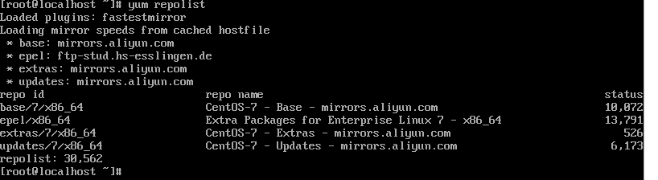

# 1. VirtualBox安装Linux

## 1.1. 设置个人信息

用户名：user

密码：1-8

## 1.2. centos版本

`CentOS-7-x86_64-Minimal-2009.iso`

## 1.3. 安装步骤

#### 1.3.1 新建虚拟电脑


- 之后设置各种信息即可，新建完成后，进行下面操作


- 顺序改成 光驱第一 硬盘第二


- 然后启动即可


#### 1.3.2 安装 CentOS 7

- 进入安装向导后设置语言：中文，时间：上海
- 分区可以直接自动分区，也可以手动设置（自定义）
- 网络可以先不管
- 等待时候可以设置一下密码，用户可以不设置


- 下面登录的时候，localhost login:  root    password：上面设置的那个


- 进行网络配置
  - 使用ip addr 看一下网卡名称——我反正没看懂
  - 输入以下命令来编辑网络配置文件：`sudo vi /etc/sysconfig/network-scripts/ifcfg-enp0s3`
  - 下面两个部分得改一下，如果如果您的网络接口名称不是enp0s3，请相应地替换它。

```
BOOTPROTO=dhcp
ONBOOT=yes
```


- 重启网络服务 ：`sudo systemctl restart network`
- ping一下宿主机及公网

```
ping 192.168.0.1
ping www.baidu.com
```


# 2. 基础Linux命令

## 2.1 vim命令

> i  --- insert
>
> 在 Vim 中，按下 `Esc` 键可以 switching to normal mode (退出输入模式)。
>
> 在 normal mode 中，可以使用以下命令退出 Vim：
>
> 1. 输入 `:q` 并按下 `Enter` 键可以保存修改并退出。
> 2. 输入 `:q!` 并按下 `Enter` 键可以不保存修改并强制退出。
> 3. 输入 `:wq` 并按下 `Enter` 键可以保存修改并退出。
> 4. 输入 `:wq!` 并按下 `Enter` 键可以保存修改并强制退出。
> 5. 输入 `:x` 并按下 `Enter` 键可以保存修改并退出。
> 6. 输入 `:exit` 或 `:exi` 并按下 `Enter` 键可以保存修改并退出。
> 7. 输入 `:exit!` 或 `:exi!` 并按下 `Enter` 键可以不保存修改并强制退出。
>
> 如果你忘记在什么模式下，可以尝试按下 `Esc` 键直到你回到 normal mode，然后再按下上述退出命令。

## 2.2 日常命令

- 关机命令
  - `sudo shutdown -h now`：该命令会立即关闭系统，并且会发送一个终端警告信息给已登录的用户，即将关闭系统。
- 重启命令
  - `sudo shutdown -r now`

- 终端上下滑动
  - `shift + pageUp / pageDown`

- ping:

  - ping -c 次数 ip  ping多少次 免的手动停止 `ctrl + z`

  - `ping -c 5 127.0.0.1` 本地ping 5次
- ping停止方法
  - 用` ctrl+c`终止ping
- 查看ip地址

  - ip addr  一样

  - hostname -i  查看当前机器的ip地址
- 查看文件内容
  - cat filename
- 查看文件目录有多少内容
  - ls
- wget命令
  - 通过 `wget` 工具从指定的网址下载文件
    - `wget https://golang.google.cn/dl/go1.19.9.linux-amd64.tar.gz`：执行此命令后，系统会下载一个名为 	`go1.19.9.linux-amd64.tar.gz` 的压缩文件，其中包含 Go 编程语言的二进制文件，可以用于在 Linux 64 位系统上	安装和运行 Go 语言。
- 创建文件夹
  - `mkdir my_folder`：创建一个  my_folder 文件夹
  - `mkdir -p parent_folder/child_folder`：创建一个名为 `parent_folder` 的父文件夹以及其内部的 `child_folder`
- 终端显示上一屏内容
  - 执行命令的时候在后面加上`> result.txt`，这样就可把结果输出到文件，就方便查看和查找相应的内容了。所以推荐用这种方法。

- 从阿里云镜像下载 CentOS 7 的 YUM 仓库配置文件，并将其保存到本地指定目录
  - `curl -o /etc/yum.repos.d/CentOS-Base.repo http://mirrors.aliyun.com/repo/Centos-7.repo`
    - 详细解释：
      - **`curl`**: 用于从指定 URL 下载数据的命令行工具。
      - **`-o /etc/yum.repos.d/CentOS-Base.repo`**: 指定将下载的文件保存到本地的路径和文件名。
        - `-o` 选项表示将下载的文件保存为指定名称。
        - `/etc/yum.repos.d/CentOS-Base.repo` 是目标路径，表示将文件保存为 `CentOS-Base.repo`，位于 `/etc/yum.repos.d/` 目录下。这个目录通常是存储 YUM 仓库配置文件的地方。
      - **`http://mirrors.aliyun.com/repo/Centos-7.repo`**: 这是文件的下载地址。该 URL 指向阿里云提供的 CentOS 7 YUM 仓库的配置文件。

- 退出当前目录
  - `cd ..` 上级目录..（两个点）

- 删除文件
  - `rm [option] filename`
  - option
    - "rm -f" 强行删除，忽略不存在的文件，不提示确认。(f为force的意思)
    - "rm -i" 进行交互式删除，即删除时会提示确认。(i为interactive的意思)
    - "rm -r" 将参数中列出的全部目录和子目录进行递归删除。(r为recursive的意思)
    - "rm -v" 详细显示删除操作进行的步骤。(v为verbose的意思)

- 查看yum源
  - `yum repolist`




- 

# 3. 安装项目所需依赖

参考该链接：https://docs.chainmaker.org.cn/dev/%E5%8F%AF%E9%AA%8C%E8%AF%81%E6%95%B0%E6%8D%AE%E5%BA%93%E4%BD%BF%E7%94%A8%E6%96%87%E6%A1%A3.html

## 3.1 安装准备

### 3.1.1 安装wget命令行工具

- 在进行部署前，先在Linux安装对应的工具

​	`sudo yum install wget`：首先安装wget命令行工具

> 命令 `sudo yum install wget` 用于在基于 Red Hat 系列的 Linux 发行版（如 CentOS、RHEL、Fedora）上通过 `yum` 包管理器安装 `wget` 工具。以下是对该命令的详细解释：
>
> - **`sudo`**: 以超级用户（root）权限执行命令。安装软件需要管理员权限，所以使用 `sudo` 来确保具有足够的权限。
> - **`yum`**: 是 Red Hat 系列 Linux 发行版中的包管理器，用于安装、更新、删除和管理软件包。
> - **`install`**: 这是 `yum` 的一个子命令，表示要安装指定的软件包。
> - **`wget`**: 这是要安装的软件包的名称。`wget` 是一个常用的命令行工具，用于从网络下载文件。
>
> **命令 `sudo yum install wget` 的作用是通过 `yum` 包管理器安装 `wget` 工具，并且使用 `sudo` 提升权限以确保安装操作的成功。执行该命令后，系统会连接到相应的软件仓库，下载并安装 `wget` 及其依赖项。**


### 3.1.2 安装 go 1.19.9

```
wget https://golang.google.cn/dl/go1.19.9.linux-amd64.tar.gz
sudo tar -C /usr/local -xzf go1.19.9.linux-amd64.tar.gz
export PATH=$PATH:/usr/local/go/bin
go version
```


### 3.1.3 配置Go代理

```
go env -w GO111MODULE=on
go env -w GOPROXY=goproxy.cn
```

代码解释：

​	这两行代码用于配置 Go 语言的环境变量，主要与 Go 模块管理和代理设置相关。它们通过 `go env -w` 命令来写入环境变量的值，永久地改变 Go 的配置。

```
go env -w GO111MODULE=on
```

- **`go env -w`**: 这个命令用于写入（write）Go 环境变量的值。
- **`GO111MODULE=on`**: 这是设置 Go 的模块管理模式。

**解释：**

`GO111MODULE` 是 Go 的一个环境变量，用于控制 Go 模块管理的行为：

- **`on`**: 强制启用 Go 模块，无论项目是在 `$GOPATH` 目录下还是其他地方。模块是 Go 从 1.11 开始引入的包管理方式，它可以更好地管理依赖版本。

通过运行这行代码，Go 将始终使用模块（module）来管理依赖，而不再依赖传统的 `$GOPATH` 方式。

```
go env -w GOPROXY=goproxy.cn
```

- **`go env -w`**: 同样是写入环境变量。
- **`GOPROXY=goproxy.cn`**: 设置 Go 代理的地址。

**解释：**

`GOPROXY` 是 Go 的一个环境变量，用于指定 Go 模块的代理服务器。当你使用 `go get` 或其他命令安装依赖时，Go 会从这个代理服务器下载模块，而不是直接从 GitHub 或其他原始仓库下载。

- **`goproxy.cn`**: 这是中国的 Go 模块代理服务器，由七牛云维护。通过使用这个代理，开发者可以加快模块的下载速度，避免网络不稳定导致的依赖安装问题。


### 3.1.4 安装 7zip

```
sudo yum -y install epel-release
sudo yum -y install p7zip p7zip-plugins
```


### 3.1.5 安装docker

```
sudo yum -y install yum-utils
sudo yum-config-manager --add-repo https://download.docker.com/linux/centos/docker-ce.repo
sudo yum -y install docker-ce docker-ce-cli containerd.io docker-buildx-plugin docker-compose-plugin
sudo systemctl start docker
sudo docker run hello-world
```


`sudo yum-config-manager --add-repo https://download.docker.com/linux/centos/docker-ce.repo` 出现错误，看 `第四部分`


`sudo docker run hello-world`运行出错，看`4`


## 3.2 安装长安链v2.3.1


# 4. 安装依赖出现的错误

## 4.1 安装 wget时出现下面错误


**解决方法**

> 换一个yum，换一个国内的源，比较快就是我们常见的阿里的yum

在终端运行

```powershell
curl -o /etc/yum.repos.d/CentOS-Base.repo http://mirrors.aliyun.com/repo/Centos-7.repo
```

然后再下载wget

```powershell
sudo yum install wget
```

## 4.2 添加yum软件源 

运行`sudo yum-config-manager --add-repo https://download.docker.com/linux/centos/docker-ce.repo`出现如下错误


- 首先，运行了 `yum update`
- 再运行上面代码，错误改变


- 之后，把vpn关掉，就可以了


## 4.3 sudo docker run hello-world出错


从截图中可以看到，运行 `sudo docker run hello-world` 时，Docker 尝试从 `registry-1.docker.io` 拉取 `hello-world` 镜像，但由于连接超时，未能成功下载镜像。

- ping 一下：ping registry-1.docker.io 不通
- 

# 5. 进度

问了师兄（朱），说让我学一下**docker基础**，虽然我跟着这个安装到了最后一步


